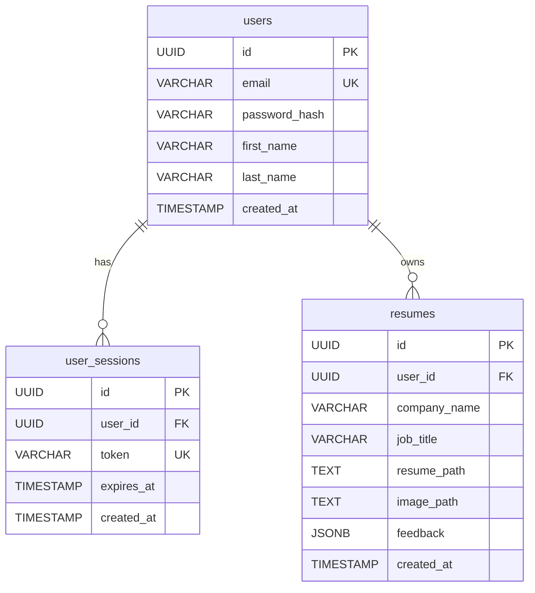
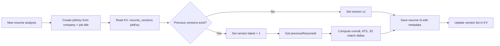

# ResumAI

ResumAI is a full-stack resume analyzer built with React Router + TypeScript.  
Users can sign up, upload a PDF resume, run AI feedback analysis, and review ATS-style scoring with improvement tips.

## Tech Stack

- React 19 + React Router 7 (SSR enabled)
- TypeScript
- Tailwind CSS 4
- PostgreSQL (`pg`)
- `bcryptjs` for password hashing
- Puter SDK (cloud file storage + AI chat)

## Core Features

- Email/password authentication with DB-backed session tokens
- Strong password enforcement (min 8 chars, uppercase, lowercase, number, special character)
- HttpOnly session cookies — JS cannot access session token (XSS-safe)
- Rate limiting: 10 login attempts / 15 min, 5 signups / hour per IP
- Resume upload (PDF)
- PDF-to-image conversion for preview
- AI feedback parsing into structured JSON score data
- Resume versioning + score comparison across versions per job target
- JD (job description) match score with matched/missing keywords
- Action plan checklist with local storage persistence
- Resume rewrite assistant (AI-powered, per section)
- Export PDF report (browser print)
- Auto logout on inactivity (`useSessionTimeout`)
- Resume history listing per user

## Routes

### Pages

- `/` Home
- `/auth` Login/Signup
- `/upload` Upload + Analyze
- `/resume/:id` Resume details

### API

- `/api/auth/check`
- `/api/auth/login`
- `/api/auth/signup`
- `/api/auth/logout`
- `/api/resumes`

## Requirements

- Node.js 20+
- npm
- PostgreSQL 16+ (local)

## Local Setup

### 1) Clone and install

```bash
git clone https://github.com/Trixxy98/AI-resumeAnalyzer.git
cd AI-resumeAnalyzer
npm ci
```

### 2) Setup PostgreSQL

Create DB:

```bash
createdb resumai
```

Run schema:

```bash
psql -d resumai -f schema.sql
```

If needed, enable extensions manually:

```bash
psql -d resumai -c 'CREATE EXTENSION IF NOT EXISTS "pgcrypto";'
psql -d resumai -c 'CREATE EXTENSION IF NOT EXISTS "uuid-ossp";'
```

### 3) Configure environment

Create `.env` in project root (`AI-resumeAnalyzer/.env`):

```env
DB_USER=rith
DB_HOST=localhost
DB_NAME=resumai
DB_PASSWORD=harith1234
DB_PORT=5432
```

Adjust values to your local PostgreSQL credentials.

### 4) Run development server

```bash
npm run dev
```

App URL: `http://localhost:5173`

## Scripts

- `npm run dev` — Run development server
- `npm run build` — Build production output
- `npm run start` — Serve built app
- `npm run typecheck` — Generate route types + TypeScript check

## Project Structure

```
app/
├── components/       # Reusable UI components
│   ├── ErrorBoundary.tsx     # Global error catcher
│   ├── SessionTimeoutManager.tsx
│   ├── ActionPlan.tsx
│   ├── ExportReportButton.tsx
│   ├── JDMatch.tsx
│   ├── RewriteAssistant.tsx
│   └── VersionCompare.tsx
├── hooks/            # Custom React hooks
│   ├── useAuthGuard.ts       # Redirect unauthenticated users
│   ├── useDebounce.ts        # Debounce heavy inputs
│   └── useSessionTimeout.ts  # Auto logout on inactivity
├── lib/              # Shared utilities and server logic
│   ├── auth.ts               # Password hashing, session CRUD
│   ├── auth-context.tsx      # React auth context
│   ├── database.ts           # PostgreSQL pool
│   ├── rate-limit.ts         # In-memory rate limiter
│   ├── session-cookie.ts     # Cookie builder (HttpOnly + Secure)
│   └── utils.ts              # parseFeedbackJson, generateUUID, cn
├── routes/           # Pages + API handlers
│   ├── home.tsx
│   ├── upload.tsx
│   ├── resume.tsx
│   ├── auth.tsx
│   └── api.auth.*.ts / api.resumes.ts
constants/
└── index.ts          # AI prompt instructions and response format
```

## Docker

Build:

```bash
docker build -t resumai .
```

Run:

```bash
docker run -p 3000:3000 resumai
```

## Database Tables

Defined in `schema.sql`:

- `users`
- `user_sessions`
- `resumes`

## Architecture Diagrams

### ERD (PostgreSQL)



### Application Flow

```mermaid
flowchart TD
    A[User opens app] --> B{Session cookie exists?}
    B -- No --> C[Go to /auth]
    B -- Yes --> D[/api/auth/check]
    D --> E{Session valid?}
    E -- No --> C
    E -- Yes --> F[Home page /]

    C --> G[Login or Signup]
    G --> H[/api/auth/login or /api/auth/signup]
    H --> I[Set session cookie]
    I --> F

    F --> J[Open /upload]
    J --> K[Fill company, job title, JD, and upload PDF]
    K --> L[Upload PDF to Puter FS]
    L --> M[Convert PDF to image]
    M --> N[Upload image to Puter FS]

    N --> O[Prepare resume record]
    O --> P[Build jobKey for versioning]
    P --> Q[Read previous versions from KV]
    Q --> R[Request AI feedback]
    R --> S[Parse feedback JSON]
    S --> T[Compute compare delta vs previous version]
    T --> U[Save resume data + version index in KV]
    U --> V[Redirect to /resume/:id]

    V --> W[Load resume details + feedback + version history]
    W --> X[Render Summary, JD Match, ATS, Details, Version Compare]
```

### Versioning Flow



## Security Notes

- Session cookies are `HttpOnly` — cannot be accessed via JavaScript
- `Secure` flag is enabled automatically in production (HTTPS)
- Passwords are hashed with bcrypt (12 salt rounds)
- Rate limiting is in-memory — on multi-instance deployments, replace with Redis
- `.env` must never be committed to git

## Common Issues

### `role "postgres" does not exist`

Your local role may not be `postgres`. Update `.env` with your actual DB username (e.g. `rith`).

### `npm ci` fails

Run command inside repo folder containing `package-lock.json`:

```bash
cd AI-resumeAnalyzer
npm ci
```

### AI response returns fenced JSON and page stays on analyzing

The app already handles fenced JSON parsing (` ```json ... ``` `).  
If it still fails, retry once and check browser console/network for AI service errors.

### `Model not found: claude-3-7-sonnet`

The app now uses provider default model to avoid hardcoded unavailable models.

## Notes

- Keep `.env` local (do not commit secrets).
- For pgAdmin usage, connect using your existing PostgreSQL role and ensure it matches `.env`.
